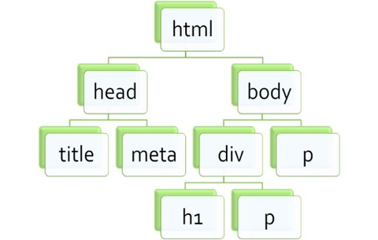
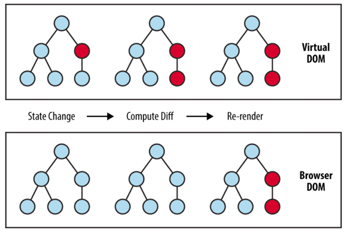

# DOM과 Virtual DOM

## 가상돔(virtual DOM)

리액트(react)나, 뷰(Vue)는 가상돔(virtual DOM)을 사용해서 원하는 화면을 브라우저에 그려준다.
자체적으로 고효율적인 알고리즘을 사용해서 그려주기 때문에 속도가 굉장히 빠르다.
가사돔의 원리를 몰라도 알아서 처리하지만 리액트로 프론트엔드를 개발하는 개발자라면 **기본소양** 정도는 알아야 한다.

## DOM

### DOM이란?

`가상 돔(Virtual DOM)`을 이해하기 위해서는 먼저 `DOM(Document Object Model)`을 이해해야한다.
브라우저를 돌아보면 수 많은 컴포넌트로 구성된 웹페이지를 볼 수있다. 그 페이지를 `문서(Document)`라고 하고, 페이지를 이루는 컴포넌트를 `엘리먼트(element)`라고 한다.

DOM은 이 엘리먼트를 `tree 형태(=DOM TREE)`로 표현한 것이다.

트리의 요소 하나하나를 '노드'라고 부르며, 각각의 '노드'는 해당 노드에 접근과 제어(DOM 조작)를 할 수 있는 API를 제공한다.

> API는 단순히 `HTML 요소에 접근해서 수정할 수 있는 함수` 라고 이해하면 편하다.

### DOM API 사용 예시

```javascript
// id가 demo인 element를 찾아, 'Hello World!'를 대입하라.
document.getElementById("demo").innerHTML = "Hello World!";

// p 태그들을 모두 찾아 element 변수에 저장하라.
const element = document.getElementsByTagName("p");

// 클래스 이름이 intro인 모든 요소를 가져와서 x변수에 저장하라.
const x = document.getElementsByClassName("intro");
```

```javascript
function validateForm() {
  let x = document.forms["myForm"]["fname"].value;
  if (x === "") {
    alert("Name must be filled out");
    return false;
  }
}

<form name="myForm" action="/action_page.php" onsubmit="return validateForm()">
  Name: <input type="text" name="fname" />
  <input type="submit" value="Submit" />
</form>;
```

## 가상돔(Virtual DOM)

### 가상돔(virtual DOM)이란?

리액트는 **가상돔(virtual DOM)**을 이용해서 실제 DOM을 변경하는 작업을 상당히 효율적으로 수행한다.

가상 DOM은 실제 DOM과 구조가 완벽히 동일한 복사본 형태라고 생각하자.

실제 DOM은 아니지만, 객체(object) 형태로 메모리에 저장되기 댸문에 실제 DOM을 조작하는 것 보다 훨씬 빠르게 작업을 수행한다.

> 실제 DOM을 조작하는 것보다 메모리상에 올라와있는 javascript 객체를 변경하는 작업이 훨씬 더 가볍다.

### DOM 조작 과정

만약 인스타그램 좋아요 버튼을 눌렀다면 화면이 바뀌어야한다.
빨간 하트에 해당되는 엘리먼트 DOM 요소가 갱신되어야 하기 때문에 `DOM을 조작`해야 한다는 의미이다.

#### [STEP 1]

이 과정에서 리액트는 항상 `2가지 버전의 가상 DOM`을 가지고 있다.

- 화면이 갱신되기 전 구조가 담겨있는 가상DOM 객체
- 화면 갱신 후 보여야 할 가상 DOM 객체
  리액트는 `state`가 변경되어야만 리렌더링이 된다. 이 때 바로 2번에 해당되는 가상DOM을 만든다.

#### [STEP 2 : diffing]

state가 변경되면 2번에서 생성된 가상돔과 1번에서 이미 갖고있었던 가상돔을 비교해서 어느 부분(엘리먼트)에서 변화가 일어났는지를 내부 알고리즘을 통해 아주 빠르게 파악한다.

#### [STEP 3 : 재조정(reconciliation)]

변경 사항 파악이 끝나면 변경이 일어난 그 부분만 실제 `DOM에 적용` 시킨다. 적용시킬 때는, 한건 한건 적용하는게 아니라 변경사항을 모두 모아 한 번만 적용을 시킨다. `Batch Update`

### Batch Update

리액트는state를 batch 방법으로 update 한다. 변경된 모든 엘리먼트를 한꺼번에 반영할 수 있는 방법이다.
<클릭 한 번으로 화면에 있는 5개의 엘리먼트가 바뀌어야 한다면>

- 실제 DOM: 5번의 화면 갱신이 필요
- 가상 DOM: Batch Update로 인해 단 한번만 갱신이 필요
